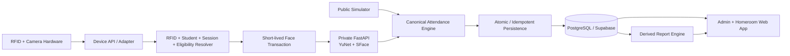

# Smart Attendance System

Full-stack, hardware-ready school attendance platform that combines RFID identity, 1:1 face verification, configurable attendance sessions, role-based staff workflows, device integration, and derived reporting through one centralized attendance model.

**Status:** Complete · **Year:** 2025 · **Role:** Full-Stack Developer, System Architect, Product Designer

[Live Demo](https://attendance-system-one-taupe.vercel.app) · [Portfolio Case Study](https://natsx.my.id/work/smart-attendance-system)


## Recruiter snapshot

This project demonstrates end-to-end engineering across the web application, database, authentication and authorization, hardware-facing API design, biometric verification, attendance domain logic, reporting, and automated testing.

| Area | Implementation |
| --- | --- |
| Web application | Next.js App Router, React, TypeScript, Tailwind CSS |
| Database & auth | PostgreSQL, Supabase, server-authoritative RBAC |
| Computer vision | Python, FastAPI, OpenCV YuNet + SFace |
| Device integration | Authenticated Device API for RFID/camera hardware |
| Reliability | Atomic + idempotent attendance finalization |
| Testing | Vitest, pytest, GitHub Actions |
| Security | RLS, server-only privileged operations, hashed device secrets |

### Engineering highlights

- Built a **canonical attendance engine** so browser screens, simulators, and real devices cannot invent attendance independently.
- Designed **RFID + 1:1 face verification** where the card resolves the expected student and facial verification confirms only that identity.
- Implemented **atomic and idempotent persistence** so network retries do not create duplicate attendance.
- Added **role-based staff workflows** for system admins, operators, and homeroom teachers.
- Built **configurable scheduling** for arrival, prayer sessions, departure, ceremonies, activities, and custom attendance sessions.
- Integrated a private **FastAPI biometric service** with YuNet detection and SFace recognition.
- Added **derived reporting** with weekly, monthly, semester, academic-year, custom-range, CSV, and print/PDF outputs.
- Covered web and Python boundaries with **Vitest, pytest, and CI quality gates**.

## Problem

RFID alone can identify which card was scanned, but it cannot prove who is holding that card. A school attendance system also has to resolve the active session, participant eligibility, timing, duplicate scans, staff permissions, and reporting rules before an attempt becomes a trusted attendance record.

The system therefore treats attendance as a server-side domain decision rather than a UI action.

## Solution

The platform separates device input, identity resolution, face verification, attendance rules, persistence, staff workflows, and reporting.

A scan resolves the expected student from RFID, verifies that student when face confirmation is required, evaluates the active attendance session and eligibility rules, then commits the result atomically. The same core rules are used whether the input comes from the public simulator or hardware-facing Device API.

## Architecture



### Hardware feedback contract

- verified owner → **GREEN LED + one short beep + attendance accepted**
- face mismatch / proxy attendance → **RED LED + rapid repeated beeps + attendance rejected**

No-face and low-quality-camera failures are intentionally different from a face mismatch and do not use the proxy-attendance alarm pattern.

## Core capabilities

### Attendance & scheduling

- RFID resolves the expected card owner server-side.
- Face-required sessions verify only that student's registered template, using 1:1 verification rather than broad face search.
- Canonical engine handles on-time, late, mismatch, no face, low quality, service error, unknown RFID, non-target session, duplicate, no active session, and outside-window states.
- Generic session engine supports arrival, Dhuha, Dzuhur, Ashar, departure, ceremonies, activities, and custom sessions.
- Sessions can target grade, class, department, student groups, or the whole school.
- Special dates can add, replace, or cancel normal schedules.
- Schedule occurrences and participant snapshots are materialized from historical enrollment, including days where nobody scans.
- Unresolved overlapping sessions fail closed instead of selecting an arbitrary row.

### Staff & administration

- Supabase Auth establishes staff identity.
- Canonical profiles and assignments own role/class authorization.
- Roles: `SYSTEM_ADMIN`, `HOMEROOM_TEACHER`, `OPERATOR`.
- No public staff sign-up.
- Secure first-admin bootstrap and in-app staff provisioning.
- Student/RFID management with credential history.
- Historical class transfers preserve old reports.
- Versioned schedule management.
- Device registry, heartbeat, status, disable, and revoke management.
- Browser-camera face enrollment stores embedding metadata instead of raw enrollment photos.

### Homeroom & reporting

- Homeroom teachers confirm **Sakit / Izin / Alpa** only when a required school arrival has no valid machine attendance.
- Valid arrival truth cannot be rewritten into an absence reason through the normal workflow.
- Weekly, monthly, semester, academic-year, and custom reports are derived from canonical records.
- Per-student H/T/S/I/A/Pending totals.
- Dhuha, Dzuhur, Ashar, and activity participation are reported separately.
- Excel-compatible CSV export includes spreadsheet formula-injection protection.
- A4 Print / Save as PDF view.

## Face verification

Private service: `services/face-service`.

- Python 3.12 + FastAPI.
- OpenCV YuNet face detector.
- OpenCV SFace 1:1 face recognizer.
- Exactly-one-face, minimum face size, blur, brightness, and detector-confidence quality gates.
- Pinned ONNX models downloaded from official OpenCV Zoo Git LFS media.
- SHA-256 verified before use.
- CI downloads and initializes both models through OpenCV.
- Raw image bytes are processed in request memory and are not written to Supabase or audit records.
- Supabase stores embedding + fingerprint + model/version/quality metadata server-side.
- Default cosine threshold `0.363` is configurable.

> **Security limitation:** liveness / presentation-attack detection is not implemented. `livenessChecked=false` is explicit. The system should not be described as resistant to printed-photo or replay-video attacks, and the default similarity threshold is a baseline rather than a school/camera-specific calibration.

## Device API

Protected routes:

- `POST /api/device/v1/heartbeat`
- `POST /api/device/v1/card-scan`
- `POST /api/device/v1/face-verify`

Device authentication uses:

- `x-device-id`
- `x-protocol-version`
- Bearer device secret over HTTPS

The database stores only the SHA-256 hash of the device secret. Devices do not declare authoritative student, class, or session identity; those values are derived server-side.

Face-required scans use short-lived verification transactions. Replay after a network interruption returns the previously committed result instead of creating duplicate attendance.

## Tech stack

- **Web/API:** Next.js App Router + TypeScript
- **UI:** React + Tailwind CSS
- **Database/Auth:** PostgreSQL + Supabase Auth
- **Validation:** Zod
- **Face service:** Python + FastAPI + OpenCV YuNet/SFace
- **Testing:** Vitest + pytest + GitHub Actions
- **Hardware path:** local serial/USB bridge → Device API
- **Network-device path:** HTTPS → Device API

Direct dependencies are pinned and locked.

## Security posture

- Attendance System uses a dedicated Supabase project.
- Public domain tables have RLS enabled.
- Browser table access is default-deny; privileged operations go through server-only application paths.
- Supabase secret/service credentials never belong in browser code or GitHub.
- Staff role/class scope is not trusted from user-editable Auth metadata.
- Biometric embeddings are not returned to browser users.
- Device plaintext secrets are never stored in the database.
- Raw biometric image base64 is not written to canonical audit/device payloads.

The latest Supabase security-advisor state has no warning/error finding. Its `RLS enabled no policy` INFO notices are intentional for this server-authoritative default-deny design.

## Demo data & public access

`supabase/seed.sql` contains synthetic portfolio data only. The school, students, RFID UIDs, schedules, and seed face references are fictional.

The public `/terminal` experience remains ephemeral so recruiter sessions cannot contaminate shared canonical attendance data. Staff routes are protected and are not exposed as a public admin sandbox.

### Main routes

- `/` — project overview
- `/terminal` — public attendance terminal
- `/login` — internal staff login
- `/dashboard` — System Admin / Operator dashboard
- `/dashboard/students` — students, RFID, class history, face status
- `/dashboard/students/[studentId]/face` — camera face enrollment
- `/dashboard/schedules` — schedule rules
- `/dashboard/devices` — device registry/monitoring
- `/dashboard/staff` — staff provisioning/RBAC
- `/teacher` — daily homeroom reconciliation
- `/teacher/reports` — reports/export
- `/teacher/reports/print` — Print / Save as PDF
- `/api/health` — non-secret web readiness

## Local development

Web:

```bash
npm ci
npm run dev
```

Face-service setup is documented in [`services/face-service/README.md`](services/face-service/README.md).

The complete user-test sequence is documented in [`docs/13-V1-TESTING-RUNBOOK.md`](docs/13-V1-TESTING-RUNBOOK.md).

## Quality gates

Node / web:

```bash
npm run lint
npm run typecheck
npm run test
npm run build
```

Face-service CI additionally performs:

- dependency installation
- Python compilation
- pytest contract tests
- official model download
- SHA-256 verification
- OpenCV YuNet/SFace runtime initialization

Database MATCH and MISMATCH paths were smoke-tested in transactions and rolled back. MATCH produced exactly one event + verification + attendance with idempotent replay; MISMATCH produced `FACE_REJECTED` and zero attendance.

## Documentation

Detailed engineering documentation remains available for deeper review:

1. [Source of Truth](docs/00-SOURCE-OF-TRUTH.md)
2. [Product Requirements](docs/01-PRD.md)
3. [User Flows](docs/02-USER-FLOWS.md)
4. [Architecture](docs/03-ARCHITECTURE.md)
5. [Domain & Data](docs/04-DOMAIN-AND-DATA.md)
6. [Device Protocol & Simulator](docs/05-DEVICE-PROTOCOL-AND-SIMULATOR.md)
7. [Security & Privacy](docs/06-SECURITY-PRIVACY.md)
8. [Roadmap](docs/07-ROADMAP-TODO.md)
9. [Working Agreements](docs/08-WORKING-AGREEMENTS.md)
10. [Decision Log](docs/09-DECISION-LOG.md)
11. [Test Strategy](docs/10-TEST-STRATEGY.md)
12. [Staff Provisioning](docs/11-STAFF-PROVISIONING.md)
13. [Schedule & Device](docs/12-SCHEDULE-AND-DEVICE-V1.md)
14. [Testing Runbook](docs/13-V1-TESTING-RUNBOOK.md)
15. [Skills](SKILLS.md)
16. [Work Log](WORK.md)

## Project rule

**Never bypass the canonical attendance engine, identity resolution, face-verification transaction, or authorization boundaries merely to make a demo screen appear functional.** Adapters may change; attendance truth and access-control rules must not.
