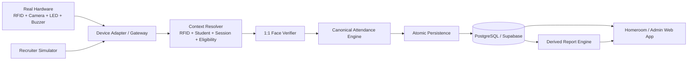

# Smart Attendance System

Modern rebuild of a 2025 SMK P5 project: a hardware-ready school attendance platform combining RFID identity, 1:1 face verification, flexible attendance sessions, staff reconciliation, and derived attendance reporting.

> **Current state:** the core attendance pipeline, Supabase domain database, RFID/session resolution, recruiter simulator, staff Auth/RBAC, homeroom absence confirmation, secure staff provisioning, and class report engine are implemented. Real biometric recognition and physical-device firmware remain future integration layers.

## Product principle

This repository is designed as a **real hardware-ready attendance system**, not a dashboard mockup. The public simulator is only an input adapter. Future Arduino/ESP-class hardware must reach the same attendance rules, persistence model, and reporting data without rewriting the application core.

## What the system already does

- RFID resolves the expected card owner.
- Face verification is modeled as 1:1 verification against that owner.
- Canonical decision engine handles verified/on-time, late, face mismatch, unknown RFID, non-target session, duplicate, no active session, and related states.
- Original physical feedback semantics are preserved:
  - accepted verification → green LED + one short beep;
  - face mismatch → red LED + rapid repeated beeps.
- Flexible session model supports arrival, departure, Dhuha, Dzuhur, Ashar, ceremonies, school activities, and future custom sessions.
- Session participants can target grades/classes/students instead of assuming the whole school attends every session.
- Raw device/verification events are separated from canonical attendance records.
- Attendance writes are atomic and idempotent for device request replay.
- Staff authentication uses Supabase Auth, while authorization remains in canonical application profiles and class assignments.
- Homeroom teachers can confirm **Sakit / Izin / Alpa** only when a required school arrival has no valid attendance.
- Teacher confirmations append history and audit logs rather than overwriting device truth.
- `/teacher/reports` derives class attendance across arbitrary date ranges from canonical attendance + teacher confirmations.
- Public `/terminal` remains recruiter-accessible without staff login and intentionally uses ephemeral demo persistence.

## Architecture



### Source-of-truth boundaries

- **Supabase Auth** → staff identity.
- **Application profiles/assignments** → role and class authorization.
- **RFID + face + session engine** → attendance truth.
- **Homeroom teacher** → reason for a missing required school arrival.
- **Canonical records + confirmations** → reports.

No browser metadata, dashboard counter, simulator button, or hardware client may replace those authorities.

## Current stack

- **Web / API:** Next.js App Router + TypeScript
- **UI:** React + Tailwind CSS
- **Database / Auth:** dedicated Attendance System Supabase project (PostgreSQL + Supabase Auth)
- **Validation:** Zod
- **Testing:** Vitest + GitHub Actions quality gate
- **Future face service:** Python + FastAPI boundary
- **Future Arduino path:** serial/USB bridge → versioned Device API
- **Future network-device path:** HTTPS → versioned Device API

Direct dependencies are pinned in `package.json` and locked in `package-lock.json`.

## Security posture

- Attendance System uses a Supabase project separate from Spall Spill.
- Every public domain table has RLS enabled.
- Current browser table access is default-deny.
- Privileged attendance, authorization, provisioning, and report RPCs are server-only.
- Supabase secret/service-role credentials never belong in browser code or GitHub.
- Staff role/class scope is not trusted from user-editable metadata.
- No public staff sign-up exists in the current MVP.
- The first staff bootstrap must be a `SYSTEM_ADMIN`; later staff provisioning requires an existing active System Admin actor.

## Fictional demo data

`supabase/seed.sql` contains synthetic portfolio data only. The school, students, RFID UIDs, schedules, and face references in that file are fictional and must never be presented as real institutional data.

The public terminal remains ephemeral so recruiter sessions cannot contaminate shared canonical attendance data.

## Main routes

- `/` — project overview
- `/terminal` — public recruiter attendance simulator
- `/login` — internal staff login
- `/dashboard` — System Admin / Operator shell
- `/teacher` — daily homeroom attendance and Sakit/Izin/Alpa reconciliation
- `/teacher/reports` — custom-range and preset class attendance reports
- `/api/health` — application health endpoint

## Staff provisioning

There is no public registration form. Staff accounts are created through a server-only provisioning workflow.

See [`docs/11-STAFF-PROVISIONING.md`](docs/11-STAFF-PROVISIONING.md).

Local provisioning can use a Git-ignored `.env.local`:

```bash
npm run staff:provision:env
```

Never commit a real password or `SUPABASE_SECRET_KEY`.

## Documentation map

The documents below are normative. When documents conflict, follow the precedence defined in the Source of Truth.

1. [`docs/00-SOURCE-OF-TRUTH.md`](docs/00-SOURCE-OF-TRUTH.md) — canonical product rules and non-negotiables.
2. [`docs/01-PRD.md`](docs/01-PRD.md) — product requirements and scope.
3. [`docs/02-USER-FLOWS.md`](docs/02-USER-FLOWS.md) — user and device flows.
4. [`docs/03-ARCHITECTURE.md`](docs/03-ARCHITECTURE.md) — technical architecture.
5. [`docs/04-DOMAIN-AND-DATA.md`](docs/04-DOMAIN-AND-DATA.md) — domain model, statuses, and data boundaries.
6. [`docs/05-DEVICE-PROTOCOL-AND-SIMULATOR.md`](docs/05-DEVICE-PROTOCOL-AND-SIMULATOR.md) — hardware contract and demo parity.
7. [`docs/06-SECURITY-PRIVACY.md`](docs/06-SECURITY-PRIVACY.md) — security and biometric-data rules.
8. [`docs/07-ROADMAP-TODO.md`](docs/07-ROADMAP-TODO.md) — milestones and acceptance gates.
9. [`docs/08-WORKING-AGREEMENTS.md`](docs/08-WORKING-AGREEMENTS.md) — engineering rules and Definition of Done.
10. [`docs/09-DECISION-LOG.md`](docs/09-DECISION-LOG.md) — architecture/product decision log.
11. [`docs/10-TEST-STRATEGY.md`](docs/10-TEST-STRATEGY.md) — test strategy and regression requirements.
12. [`docs/11-STAFF-PROVISIONING.md`](docs/11-STAFF-PROVISIONING.md) — secure staff bootstrap/provisioning runbook.
13. [`SKILLS.md`](SKILLS.md) — engineering capability map.
14. [`WORK.md`](WORK.md) — current implementation state and next build target.

## Local development

```bash
npm ci
npm run dev
```

Then open `/terminal` for the public simulator. Protected staff routes additionally require the Attendance System Supabase environment variables.

## Quality gate

```bash
npm run lint
npm run typecheck
npm run test
npm run build
```

The same checks run in GitHub Actions for every push to `main` and pull request.

## Project rule

**Never bypass the canonical attendance engine or authorization boundaries merely to make a demo screen appear functional.** Adapters may change; attendance truth and access-control rules must not.
