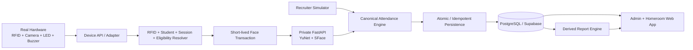

# Smart Attendance System

Modern rebuild of a 2025 SMK P5 project: a hardware-ready school attendance platform combining RFID identity, 1:1 face verification, flexible attendance sessions, staff reconciliation, and derived attendance reporting.

> **V1 status:** implementation is complete and ready for user E2E testing. The web app, Supabase domain/RBAC/reporting layer, Device API, admin/homeroom workflows, local YuNet + SFace face service, face enrollment, biometric transaction finalization, and exports are implemented and automated quality gates are green.

## Product principle

This repository is a **real hardware-ready attendance system**, not a dashboard mockup. The public simulator is only an adapter. Future Arduino/ESP-class hardware must reach the same attendance rules, persistence model, face-verification boundary, and reporting data without rewriting the application core.

## Core flow



### Original feedback contract

- verified owner → **GREEN LED + one short beep + attendance accepted**;
- face mismatch / proxy attendance → **RED LED + rapid repeated beeps + attendance rejected**.

No-face/low-quality camera failures are intentionally different from a face mismatch and do not use the proxy-attendance alarm pattern.

## V1 capabilities

### Attendance & scheduling

- RFID resolves the expected card owner server-side.
- Face-required sessions verify only that student's registered template (1:1, not broad face search).
- Canonical engine handles on-time, late, mismatch, no face, low quality, service error, unknown RFID, non-target session, duplicate, no active session, and outside-window states.
- Generic session engine supports arrival, Dhuha, Dzuhur, Ashar, departure, ceremonies, activities, and custom sessions.
- Dhuha/other sessions can target grade/class/department/student groups instead of assuming the whole school participates together.
- Special dates can add, replace, or cancel normal schedules.
- Schedule occurrences and participant snapshots are materialized from historical enrollment, including days where nobody scans.
- Unresolved overlapping sessions fail closed instead of picking an arbitrary row.

### Staff & administration

- Supabase Auth establishes staff identity.
- Canonical `profiles` and assignments own role/class authorization.
- Roles: `SYSTEM_ADMIN`, `HOMEROOM_TEACHER`, `OPERATOR`.
- No public staff sign-up.
- Secure first-admin bootstrap + in-app staff provisioning.
- Student/RFID management with credential history.
- Historical class transfers preserve old reports.
- Versioned schedule management.
- Device registry/heartbeat/status/disable/revoke management.
- Browser camera face enrollment stores embedding metadata, not the raw photo.

### Homeroom & reporting

- Wali kelas confirms **Sakit / Izin / Alpa** only when a required school arrival has no valid machine attendance.
- Valid arrival truth cannot be rewritten into an absence reason through the normal workflow.
- Weekly/monthly/semester/academic-year/custom reports are derived from canonical records.
- Per-student H/T/S/I/A/Pending totals.
- Dhuha/Dzuhur/Ashar/activity participation reported separately.
- Excel-compatible CSV export with spreadsheet formula-injection protection.
- A4 Print / Save as PDF view.

## Real face verification V1

Private service: `services/face-service`.

- Python 3.12 + FastAPI.
- OpenCV YuNet face detector.
- OpenCV SFace 1:1 face recognizer.
- Exactly-one-face, minimum face size, blur, brightness, and detector-confidence quality gates.
- Pinned ONNX models downloaded from official OpenCV Zoo Git LFS media.
- SHA-256 verified before use.
- CI actually downloads and initializes both models through OpenCV.
- Raw image bytes are processed in request memory and are not written to Supabase/audit records.
- Supabase stores embedding + fingerprint + model/version/quality metadata server-side.
- Default cosine threshold `0.363` is configurable.

> **Security limitation:** V1 does **not** implement liveness / presentation-attack detection. `livenessChecked=false` is explicit. Do not describe V1 as resistant to printed-photo or replay-video attacks. The default similarity threshold is also a baseline, not school/camera-specific calibration.

## Device API V1

Protected routes:

- `POST /api/device/v1/heartbeat`
- `POST /api/device/v1/card-scan`
- `POST /api/device/v1/face-verify`

Device authentication uses:

- `x-device-id`
- `x-protocol-version`
- Bearer device secret over HTTPS.

The database stores only the SHA-256 hash of the device secret. Devices do not declare authoritative student/class/session identity; those are derived server-side.

Face-required scans use short-lived verification transactions. Replay after a network interruption returns the previously committed result rather than creating duplicate attendance.

## Current stack

- **Web/API:** Next.js App Router + TypeScript
- **UI:** React + Tailwind CSS
- **Database/Auth:** dedicated Attendance System Supabase project (PostgreSQL + Supabase Auth)
- **Validation:** Zod
- **Face service:** Python + FastAPI + OpenCV YuNet/SFace
- **Testing:** Vitest + pytest + GitHub Actions
- **Future Arduino USB path:** local serial/USB bridge → Device API
- **Network-device path:** HTTPS → Device API

Direct dependencies are pinned and locked.

## Security posture

- Attendance System Supabase project is separate from Spall Spill.
- Public domain tables have RLS enabled.
- Current browser table access is default-deny; privileged operations go through server-only application paths.
- Supabase secret/service credentials never belong in browser code or GitHub.
- Staff role/class scope is not trusted from user-editable Auth metadata.
- Biometric embeddings are not returned to browser users.
- Device plaintext secrets are never stored in the DB.
- Raw biometric image base64 is not written to canonical audit/device payloads.

Latest Supabase security advisor state has no warning/error finding; its `RLS enabled no policy` INFO notices are intentional for this server-authoritative default-deny design.

## Fictional demo data

`supabase/seed.sql` contains synthetic portfolio data only. The school, students, RFID UIDs, schedules, and seed face references are fictional.

The public `/terminal` remains ephemeral so recruiter sessions cannot contaminate shared canonical attendance data.

## Main routes

- `/` — project overview
- `/terminal` — public recruiter simulator
- `/login` — internal staff login
- `/dashboard` — System Admin / Operator dashboard
- `/dashboard/students` — students, RFID, class history, face status
- `/dashboard/students/[studentId]/face` — camera face enrollment
- `/dashboard/schedules` — schedule rules
- `/dashboard/devices` — device registry/monitoring
- `/dashboard/staff` — staff provisioning/RBAC
- `/teacher` — daily homeroom reconciliation
- `/teacher/reports` — reports/export
- `/teacher/reports/print` — Print / Save as PDF
- `/api/health` — non-secret web readiness

## Local development

Web:

```bash
npm ci
npm run dev
```

Face service setup is documented in [`services/face-service/README.md`](services/face-service/README.md).

The complete user-test sequence is documented in [`docs/13-V1-TESTING-RUNBOOK.md`](docs/13-V1-TESTING-RUNBOOK.md).

## Quality gate

Node / web:

```bash
npm run lint
npm run typecheck
npm run test
npm run build
```

Face-service GitHub CI additionally performs:

- dependency installation;
- Python compilation;
- pytest contract tests;
- official model download;
- SHA-256 verification;
- OpenCV YuNet/SFace runtime initialization.

Database Stage 2 MATCH and MISMATCH paths were also smoke-tested in transactions and rolled back: MATCH produced exactly one event + verification + attendance with idempotent replay; MISMATCH produced `FACE_REJECTED` and zero attendance.

## Documentation map

Normative/handoff documents:

1. [`docs/00-SOURCE-OF-TRUTH.md`](docs/00-SOURCE-OF-TRUTH.md)
2. [`docs/01-PRD.md`](docs/01-PRD.md)
3. [`docs/02-USER-FLOWS.md`](docs/02-USER-FLOWS.md)
4. [`docs/03-ARCHITECTURE.md`](docs/03-ARCHITECTURE.md)
5. [`docs/04-DOMAIN-AND-DATA.md`](docs/04-DOMAIN-AND-DATA.md)
6. [`docs/05-DEVICE-PROTOCOL-AND-SIMULATOR.md`](docs/05-DEVICE-PROTOCOL-AND-SIMULATOR.md)
7. [`docs/06-SECURITY-PRIVACY.md`](docs/06-SECURITY-PRIVACY.md)
8. [`docs/07-ROADMAP-TODO.md`](docs/07-ROADMAP-TODO.md)
9. [`docs/08-WORKING-AGREEMENTS.md`](docs/08-WORKING-AGREEMENTS.md)
10. [`docs/09-DECISION-LOG.md`](docs/09-DECISION-LOG.md)
11. [`docs/10-TEST-STRATEGY.md`](docs/10-TEST-STRATEGY.md)
12. [`docs/11-STAFF-PROVISIONING.md`](docs/11-STAFF-PROVISIONING.md)
13. [`docs/12-SCHEDULE-AND-DEVICE-V1.md`](docs/12-SCHEDULE-AND-DEVICE-V1.md)
14. [`docs/13-V1-TESTING-RUNBOOK.md`](docs/13-V1-TESTING-RUNBOOK.md)
15. [`SKILLS.md`](SKILLS.md)
16. [`WORK.md`](WORK.md)

## Project rule

**Never bypass the canonical attendance engine, identity resolution, face-verification transaction, or authorization boundaries merely to make a demo screen appear functional.** Adapters may change; attendance truth and access-control rules must not.
