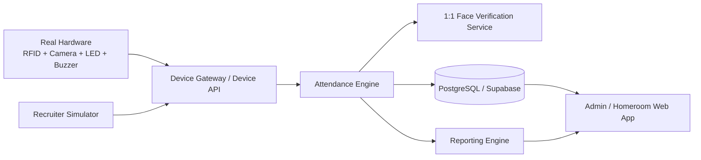

# Smart Attendance System

Rebuild and modernization of a 2025 P5 SMK project: a school attendance system that combines RFID identity, 1:1 face verification, device feedback, flexible attendance sessions, and automated reporting.

> **Status:** Foundation implementation is underway. The first hardware-ready domain engine and recruiter terminal simulator are now in the repository.

## Product principle

This repository must produce a **real hardware-ready attendance system**, not a visual mockup. During development, real Arduino/ESP32 hardware may be replaced by a simulator, but both must use the same backend contracts and attendance rules.

## Current runnable slice

The first implementation slice establishes the engineering boundary before database/dashboard work:

- Next.js + TypeScript application scaffold;
- canonical pure attendance decision engine;
- outcomes for verified/on-time, verified/late, face mismatch, unknown RFID, non-target session, duplicate, and no active session;
- preserved feedback semantics: success = green + one beep, face mismatch = red + rapid repeated beeps;
- `/terminal` recruiter simulator;
- `/api/demo/attempt` demo adapter that calls the canonical engine rather than declaring results in the UI;
- `/api/health` health endpoint;
- unit tests and GitHub Actions CI.

The demo currently uses deterministic adapter fixtures for card/session/face resolution. It intentionally does **not** claim real biometric recognition or database persistence yet.

## Core capabilities

- RFID identifies the student.
- Face verification confirms that the person using the card is the registered card owner.
- Successful verification: attendance accepted; physical device should use green LED + one short beep.
- Failed face verification: attendance rejected; physical device should use red LED + rapid repeated beeps.
- The system automatically determines only operational attendance facts such as **present/on-time, late, or no valid attendance recorded**.
- A homeroom teacher confirms the final reason for a student's school absence: **Sick (Sakit), Permission (Izin), or Unexcused Absence (Alpa)**.
- Supports multiple attendance sessions, including school arrival, school departure, Dhuha, Dzuhur, Ashar, ceremonies, Friday-cleaning activities, and future custom events.
- Dhuha and other sessions can target different grades/classes on different days.
- Special dates such as 17 August can require attendance even when they are outside the normal school schedule.
- Weekly, monthly, semester, academic-year, annual, and custom-range reporting are generated automatically.
- Demo/recruiter mode simulates hardware without changing the core backend behavior.

## Documentation map

The documents below are normative. When documents conflict, follow the precedence defined in the Source of Truth.

1. [`docs/00-SOURCE-OF-TRUTH.md`](docs/00-SOURCE-OF-TRUTH.md) — canonical product rules and non-negotiables.
2. [`docs/01-PRD.md`](docs/01-PRD.md) — product requirements and scope.
3. [`docs/02-USER-FLOWS.md`](docs/02-USER-FLOWS.md) — user and device flows.
4. [`docs/03-ARCHITECTURE.md`](docs/03-ARCHITECTURE.md) — target technical architecture.
5. [`docs/04-DOMAIN-AND-DATA.md`](docs/04-DOMAIN-AND-DATA.md) — domain model, statuses, and data boundaries.
6. [`docs/05-DEVICE-PROTOCOL-AND-SIMULATOR.md`](docs/05-DEVICE-PROTOCOL-AND-SIMULATOR.md) — hardware contract and demo parity.
7. [`docs/06-SECURITY-PRIVACY.md`](docs/06-SECURITY-PRIVACY.md) — security and biometric-data rules.
8. [`docs/07-ROADMAP-TODO.md`](docs/07-ROADMAP-TODO.md) — milestones and acceptance gates.
9. [`docs/08-WORKING-AGREEMENTS.md`](docs/08-WORKING-AGREEMENTS.md) — engineering rules and Definition of Done.
10. [`docs/09-DECISION-LOG.md`](docs/09-DECISION-LOG.md) — architecture/product decision log.
11. [`docs/10-TEST-STRATEGY.md`](docs/10-TEST-STRATEGY.md) — test strategy and regression requirements.
12. [`SKILLS.md`](SKILLS.md) — engineering capabilities required by the project.
13. [`WORK.md`](WORK.md) — current work state and next build target.

## Target system layers



## Implementation stack

- **Web / API:** Next.js App Router + TypeScript
- **UI:** React + Tailwind CSS
- **Database/Auth:** dedicated Attendance System Supabase project (PostgreSQL); live project connection pending explicit organization selection
- **Face boundary:** future Python + FastAPI service
- **Future Arduino path:** Python serial/USB bridge → versioned Device API
- **Future ESP32 path:** HTTPS → versioned Device API

Direct dependency versions are pinned in `package.json` and upgraded deliberately.

## Local development

```bash
npm install
npm run dev
```

Then open `/terminal` to run the current recruiter simulator.

Once the generated lockfile is committed, CI/local clean installs should use `npm ci`.

## Project rule

**Do not implement a feature by bypassing the canonical attendance engine only to make the demo look functional.** Simulator behavior must remain replaceable by real hardware input.
