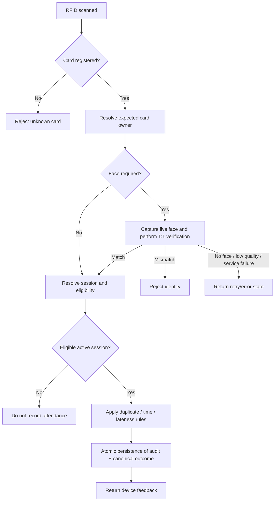

# Project Source of Truth

**Project:** Smart Attendance System  
**Origin:** Rebuild and modernization of a 2025 P5 SMK project  
**Document role:** Highest-priority product specification  
**Status:** V1 test-ready baseline — 2026-09-03

---

## 1. Precedence

If project documents conflict, use this order:

1. This file — `docs/00-SOURCE-OF-TRUTH.md`
2. Explicit decisions recorded in `docs/09-DECISION-LOG.md`
3. `docs/01-PRD.md`
4. Architecture/domain/device/security documents
5. Roadmap / work plan
6. Existing implementation

**Existing code never overrides a documented product rule.** If implementation and this document disagree, implementation is wrong until the documentation is intentionally revised.

---

## 2. Product definition

This is a school attendance management system whose original physical-terminal concept consists of RFID, camera-based face verification, green/red indicators, buzzer feedback, backend/database, and reporting.

The rebuild must remain useful without current physical hardware. A simulator/recruiter demo may replace device input, but the software must remain genuinely integrable with physical hardware later.

Primary problems:

1. reduce proxy attendance/card lending by verifying that the person presenting an RFID card matches the registered owner;
2. capture attendance across multiple school/activity sessions;
3. automate weekly, monthly, semester, academic-year/annual, and custom-range recaps;
4. support targeted recurring schedules and one-off/special school activities.

---

## 3. Canonical verification flow

### Hardware feedback semantics

- **Verified / accepted:** green LED + one short beep.
- **Face mismatch / proxy-attendance rejection:** red LED + rapid repeated beeps.
- `not eligible`, `outside session`, `duplicate`, `no face`, `low quality`, and service failures must not masquerade as face mismatch; they use neutral/error feedback.

---

## 4. Face verification rule

Face capability is primarily **1:1 verification**:

1. RFID determines the expected student.
2. Camera provides a live face sample.
3. Face service compares only against that student's active enrolled template.

The product does not require unrestricted 1:N identification or school-wide face search.

### V1 biometric implementation truth

V1 uses a replaceable private Python/FastAPI service with:

- OpenCV YuNet face detection;
- OpenCV SFace template extraction and 1:1 cosine comparison;
- pinned model versions checked by SHA-256 before use;
- baseline cosine threshold `0.363`, configurable;
- basic quality checks for exactly one face, face size, detector confidence, blur, and brightness;
- versioned enrollment templates stored as derived embeddings/fingerprints/model metadata;
- raw enrollment/verification images processed in request memory and **not persisted** in canonical Supabase tables/audit/device payloads.

The baseline threshold is not a claim of institution/camera-specific calibration.

### Explicit V1 biometric limitation

**Liveness / presentation-attack detection is not implemented.**

V1 must not be described as resistant to printed-photo or replay-video spoofing. `livenessChecked=false` is deliberate. High-assurance deployment requires a separately evaluated anti-spoof/liveness layer and consented threshold calibration for the real camera/environment/population.

---

## 5. Attendance sessions

Attendance is **session-based**, not a single daily boolean.

Initial session families:

- School Arrival / Masuk
- School Departure / Pulang
- Dhuha
- Dzuhur
- Ashar
- Ceremony / Upacara
- School Activity / Kegiatan Sekolah
- Custom future session

A session can define date/recurrence, open/close window, optional late threshold, participants, verification requirements, attendance mode, and relationship to the normal calendar.

### Dhuha

Dhuha does not have to involve the whole school at once. Different grades/classes may be scheduled on different days. Example mappings are configuration/demo data and must never be hard-coded.

A student outside today's target is **not absent** from that Dhuha occurrence.

### Dzuhur / Ashar

These are configurable regular sessions with target groups and time windows.

### Special dates and activities

Support one-off or recurring activities such as:

- 17 August ceremony requiring arrival/departure even outside ordinary schedule;
- Jumat Bersih;
- future ceremonies, religious activities, class meetings, competitions, and custom events.

Targets may include all students, grade, class, department/major, or selected students.

---

## 6. School-day attendance status ownership

The system may automatically derive operational facts:

- valid/on-time attendance;
- late attendance;
- no valid attendance for a required school-arrival session.

The system must **not automatically decide Sakit, Izin, or Alpa**.

When no valid required arrival exists, status remains pending until an authorized Homeroom Teacher confirms:

- Sakit
- Izin
- Alpa

Valid machine arrival attendance cannot be converted to Sakit/Izin/Alpa through the normal homeroom workflow. Confirmation actor/time/note/history must remain auditable.

---

## 7. Raw events vs canonical attendance

Keep raw/audit events separate from canonical attendance records.

Raw examples: RFID scan, unknown UID, face attempt, mismatch, duplicate, outside session, device heartbeat/error.

Canonical examples: accepted school arrival, attended Dhuha occurrence, pending required school day.

Reports use canonical records + authorized confirmations; raw events remain audit/troubleshooting evidence.

---

## 8. Reporting truth

Reports are generated from system data, never manually maintained duplicate totals.

Required periods:

- Daily
- Weekly
- Monthly
- Semester
- Academic year / annual
- Custom date range

Dimensions:

- per student;
- per class;
- formal school attendance;
- lateness;
- prayer/activity participation;
- special-event participation.

V1 export paths are Excel-compatible CSV and printable/Save-as-PDF report view.

Prayer/activity participation percentage remains intentionally unresolved until the Sakit/Izin denominator policy is decided; do not invent that percentage.

---

## 9. Roles

### System Admin

Manages institution configuration, staff roles, academic structure, students, RFID, face enrollment, schedules, devices, and reports.

### Homeroom Teacher / Wali Kelas

Accesses assigned class(es), reviews attendance, confirms Sakit/Izin/Alpa for valid pending school-day cases, inspects session participation, and generates reports.

### Operator

Monitors device/terminal health and operational state without unrestricted student/schedule/staff administration.

### Student login

Not required for V1.

---

## 10. Hardware/simulator parity

Simulator exists because physical hardware is optional during rebuild, not because the backend is fake.

Real device and simulator adapters must reach canonical attendance rules. Hardware clients cannot become the source of policy/student/session truth.

A later Arduino/ESP integration should require device adapter/bridge/firmware work, not rewriting attendance business logic.

---

## 11. Architecture boundaries

1. **Device Layer** — RFID, camera, LED, buzzer, Arduino/ESP or simulator.
2. **Device API/Gateway** — device auth, replay/time validation, event normalization.
3. **Face Verification Service** — replaceable 1:1 biometric inference.
4. **Attendance Domain Engine** — canonical acceptance/rejection/lateness/session rules.
5. **Persistence** — configuration, raw events, verification, canonical attendance, audit.
6. **Web Application** — admin, homeroom, reports, device management, enrollment/simulator controls.
7. **Reporting Engine** — derived summaries/exports.

Frontend/browser/device clients never become authoritative attendance decision makers.

---

## 12. Security and privacy truth

- Biometric data is sensitive.
- V1 stores derived embeddings/templates and metadata, not raw enrollment/verification photos.
- Raw face JPEG/base64 must not be persisted in Supabase canonical/audit/device payloads.
- Biometric embeddings are server-side and must not be exposed as normal browser data.
- Face-service requests require a private server-to-server credential.
- Device endpoints require independent device authentication and replay/idempotency protection.
- Device plaintext secrets are not stored in the database; only a cryptographic hash is stored.
- Staff roles/class scope come from canonical application data, not editable Auth metadata.
- Homeroom access is constrained to assigned classes unless System Admin authority applies.
- Security/audit events are not editable as ordinary attendance records.
- Public browser table access remains default-deny in the V1 server-authoritative architecture.
- Real-school use requires privacy/consent/legal review before enrolling actual student biometrics.

See `docs/06-SECURITY-PRIVACY.md` and ADR-019.

---

## 13. Explicit non-goals for V1

V1 does not claim or require:

- payroll integration;
- billing;
- full LMS/grading;
- unrestricted facial surveillance/1:N identification;
- liveness/anti-spoof resistance;
- possession of physical Arduino/ESP hardware to run software tests;
- final production deployment hardening for a real institution.

---

## 14. Open decisions — do not silently assume

These remain unresolved unless a later ADR explicitly decides them:

1. Final product/brand name and visual direction.
2. Exact production school arrival/lateness/departure time policy.
3. Exact production Dzuhur/Ashar schedule.
4. Exact production/demo Dhuha targeting beyond configurable fixtures.
5. Missing-departure effect on school-day status/reporting.
6. Whether prayer/activity denominator excludes Sakit/Izin school days.
7. Evidence attachment requirements for Sakit/Izin.
8. Manual correction approval model beyond the existing guarded homeroom absence confirmation.
9. School/camera/population-specific biometric threshold calibration.
10. Liveness/presentation-attack implementation.
11. Production hosting/edge protection/monitoring/backups/cost constraints.
12. Final administrative report template if native XLSX/server PDF is required beyond current CSV + print-PDF.
13. Final priority/routing policy for truly overlapping active sessions; V1 fails closed.

---

## 15. Definition of V1 success

V1 is successful when:

1. recruiter can exercise canonical behavior through simulator;
2. hardware-compatible Device API can receive RFID + camera flow without business-rule rewrite;
3. face mismatch cannot create valid attendance;
4. correct face can create exactly one canonical attendance;
5. retry cannot duplicate attendance;
6. targeted sessions do not mark non-target students absent;
7. special events can create attendance obligations outside normal schedules;
8. homeroom teachers can confirm Sakit/Izin/Alpa without manually rebuilding totals;
9. weekly through annual reports regenerate from canonical records;
10. system remains auditable/testable with explicit limitations rather than fake security claims.

Automated/unit/build/model/database smoke evidence can establish software readiness. Real camera/login/device E2E is performed by the user with their own credentials/face/device environment using `docs/13-V1-TESTING-RUNBOOK.md`.
