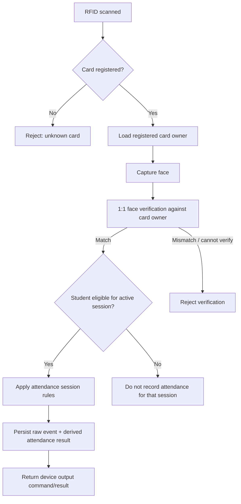

# Project Source of Truth

**Project:** Smart Attendance System  
**Origin:** Rebuild and modernization of a 2025 P5 SMK project  
**Document role:** Highest-priority product specification  
**Status:** Baseline v1.0 — 2026-09-03

---

## 1. Precedence

If project documents conflict, use this order:

1. This file — `docs/00-SOURCE-OF-TRUTH.md`
2. Explicit decisions recorded in `docs/09-DECISION-LOG.md`
3. `docs/01-PRD.md`
4. Architecture/domain/device/security documents
5. Roadmap / work plan
6. Existing implementation

**Existing code never overrides a documented product rule.** If implementation and this document disagree, the implementation is considered wrong until the documentation is intentionally revised.

---

## 2. Product definition

The project is a school attendance management system whose original physical terminal concept consists of:

- RFID card and reader/scanner;
- camera module;
- face verification;
- green/red visual indicators;
- buzzer audio feedback;
- backend/database and reporting.

The rebuild must be useful even while no physical hardware is connected. A simulator/recruiter demo replaces device input during development, but the system must remain genuinely integrable with real hardware later.

The primary problems solved are:

1. reduce proxy attendance / card lending by verifying that the card user matches the registered card owner;
2. automate school attendance capture across multiple attendance sessions;
3. automate weekly, monthly, semester, academic-year/annual, and custom-range recaps so homeroom teachers do not manually tally attendance;
4. support real school scheduling patterns, including targeted recurring sessions and special-event attendance.

---

## 3. Canonical verification flow

### Hardware feedback semantics

- **Verified / accepted:** green LED + one short beep.
- **Face mismatch / rejected:** red LED + rapid repeated beeps.
- Other non-fraud/non-match states such as `not eligible`, `outside session`, or `duplicate` should have distinct neutral/error feedback instead of pretending they are face mismatches. Exact patterns remain configurable until hardware implementation.

---

## 4. Face verification rule

The face capability is primarily **1:1 face verification**:

1. RFID determines the expected person.
2. The camera provides the live face sample.
3. The face service compares the sample only against the registered reference for the RFID owner.

The product does not require unrestricted 1:N identification of everyone in front of the camera.

---

## 5. Attendance sessions

Attendance is **session-based**, not a single daily boolean.

Required initial session families:

- School Arrival / Masuk
- School Departure / Pulang
- Dhuha
- Dzuhur
- Ashar
- Ceremony / Upacara
- School Activity / Kegiatan Sekolah
- Custom future session

A session has its own:

- date or recurrence rule;
- opening/closing time window;
- optional late threshold;
- eligible participant set;
- verification requirements;
- attendance behavior;
- relationship to normal calendar (normal/additive/override/cancelled).

### Dhuha rule

Dhuha is not necessarily scheduled for the whole school at once. The schedule can target different grades/classes on different days.

Example only — never hard-code:

- Tuesday → Grade 10
- Wednesday → Grade 11
- Thursday → Grade 12

A student who is not targeted by today's Dhuha session is **not absent** from Dhuha.

### Dzuhur / Ashar

These can be scheduled as regular sessions on eligible school days, with configurable target groups and time windows.

### Special dates and activities

The schedule engine must support one-off or recurring school activities such as:

- 17 August ceremony where students may be required to check in and check out even if the date is outside the ordinary school pattern;
- Friday cleaning (`Jumat Bersih`);
- future ceremonies, religious activities, class meetings, competitions, or other custom events.

An event can target all students, a grade, multiple classes, one class, or selected students. Broader selectors such as department/major may be supported by the domain model.

---

## 6. School-day attendance status ownership

The system may automatically derive operational facts such as:

- valid/on-time attendance;
- late attendance;
- no valid attendance recorded for a required school arrival session.

The system must **not automatically decide** that a student is Sakit, Izin, or Alpa.

For a school day where no valid arrival attendance exists, the record remains pending/unconfirmed until the homeroom teacher confirms one of:

- **Sakit** — Sick
- **Izin** — Permission / Excused
- **Alpa** — Unexcused absence

The system should preserve who confirmed the status, when, and any optional note/evidence if that feature is enabled.

---

## 7. Raw events vs attendance records

The system must preserve the distinction between:

### Raw / audit events

Examples:

- RFID scanned;
- unknown UID;
- face capture attempted;
- face verified;
- face mismatch;
- duplicate scan;
- outside session;
- device heartbeat/status.

### Derived attendance records

Examples:

- student X attended school arrival at 06:48 and was on time;
- student Y attended Dhuha session Z;
- student Z has no valid school arrival and requires homeroom confirmation.

Reports are built from canonical attendance records and their confirmed statuses, while raw events remain available for audit/troubleshooting.

---

## 8. Reporting truth

Reports must be generated from system data, not manually maintained duplicate totals.

Minimum reporting periods:

- Daily
- Weekly
- Monthly
- Semester
- Academic year / annual
- Custom date range

Minimum report dimensions:

- per student;
- per class;
- school attendance status;
- lateness;
- prayer/activity-session participation;
- special-event participation.

Exports are expected for practical school use. Excel/CSV and printable/PDF reporting are planned; exact formats are defined during implementation.

---

## 9. Roles

### System Admin

Can manage institution configuration, academic calendar, users/roles, classes, students, RFID registrations, face enrollment status, attendance sessions, devices, and global reports.

### Homeroom Teacher / Wali Kelas

Can access the class(es) assigned to them, review attendance, confirm Sakit/Izin/Alpa for school-day non-attendance, inspect relevant session participation, and generate class reports.

### Operator (optional but supported)

Can monitor terminals/device health and operational attendance flows without receiving unrestricted administrative access.

### Student login

Not required for the initial MVP. Student-facing access may be added later without changing the core attendance model.

---

## 10. Hardware/simulator parity

The simulator exists because physical hardware is currently optional, not because the backend is fake.

Both real hardware and the simulator must:

- identify themselves as a device/client;
- send events through the same versioned device contract;
- receive the same canonical domain outcomes;
- never contain authoritative attendance policy only inside the client.

A later physical integration should require adding/configuring a device adapter, not rewriting the web application or attendance engine.

---

## 11. Architecture boundaries

The system must maintain these conceptual layers:

1. **Device Layer** — RFID, camera, LEDs, buzzer, Arduino/ESP32 or simulator.
2. **Device Gateway / Device API** — validates device identity and normalizes device events.
3. **Face Verification Service** — performs the 1:1 verification behind a replaceable interface.
4. **Attendance Domain Engine** — determines eligibility, session, lateness, duplicates, acceptance/rejection, pending absence confirmation.
5. **Persistence** — canonical records, raw events, configuration, audit metadata.
6. **Web Application** — admin, homeroom, reporting, device monitoring, simulator controls.
7. **Reporting Engine** — derives summaries/exports from canonical records.

The frontend must not become the source of truth for attendance decisions.

---

## 12. Security and privacy truth

- Biometric data must be treated as sensitive.
- Prefer storing derived face templates/embeddings rather than unnecessary raw face imagery.
- Any stored verification snapshots require an explicit retention policy.
- Demo biometric data should be temporary/ephemeral by default.
- Device endpoints require authentication and replay/duplicate protection appropriate to the selected protocol.
- Role-based authorization must constrain teacher access to assigned classes.
- Security/audit events must not be editable as ordinary attendance data.

See `docs/06-SECURITY-PRIVACY.md`.

---

## 13. Explicit non-goals for the first release

Unless deliberately added later, the first release does not need:

- payroll integration;
- parent billing;
- full LMS functionality;
- grading/academic marks;
- unrestricted facial surveillance or school-wide 1:N face search;
- dependence on owning physical Arduino/ESP32 hardware to run the demo.

---

## 14. Open decisions — do not silently assume

These remain intentionally unresolved until they are discussed and recorded:

1. Final product/brand name and UI visual direction.
2. Exact school arrival, lateness, and departure time rules.
3. Exact regular Dzuhur/Ashar schedule.
4. Exact Dhuha target schedule for the demo dataset.
5. Whether school departure is mandatory for every ordinary day and how missing departure affects final daily attendance.
6. Whether prayer/activity participation denominators exclude students whose school-day status is confirmed Sakit/Izin.
7. Whether homeroom teachers can attach proof documents for Sakit/Izin and whether attachments are required.
8. Raw verification snapshot retention policy.
9. Exact face verification model/library/service and threshold calibration.
10. Exact production hosting architecture and cost constraints.
11. Exact export templates required to resemble school administrative forms.
12. Whether special events can independently use check-in only, check-out only, single-presence, or paired check-in/check-out modes — architecture should support all, final UI to be decided.

When one of these becomes decided, update this document and add an ADR entry in `docs/09-DECISION-LOG.md`.

---

## 15. Definition of product success

The rebuild is successful when:

1. a recruiter can use a hardware simulator to experience the same core flow as a real terminal;
2. a real hardware adapter can later submit RFID/camera events without changing attendance business rules;
3. face mismatch cannot create valid attendance;
4. targeted sessions do not mark non-target students absent;
5. special school events can generate attendance requirements outside normal schedules;
6. homeroom teachers can confirm Sakit/Izin/Alpa without manually rebuilding attendance totals;
7. weekly through annual reports are reproducible directly from canonical records;
8. the system remains auditable, testable, and secure enough to demonstrate professional engineering practice.
