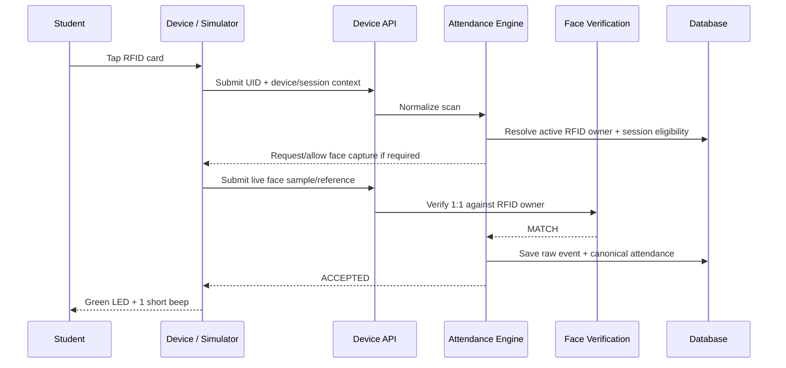
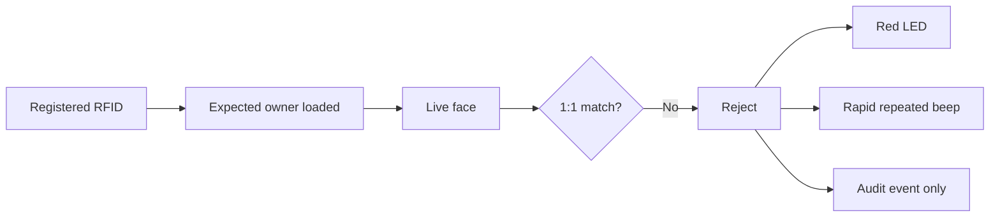
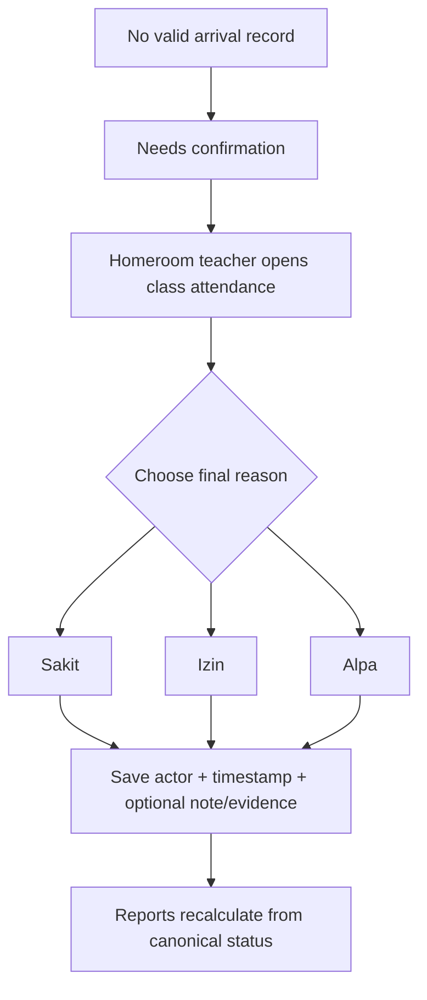
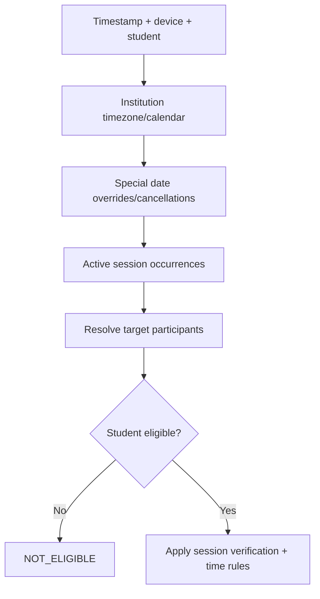

# User & Device Flows

**Source of truth:** `docs/00-SOURCE-OF-TRUTH.md`

This document describes expected end-to-end behavior. It is not UI-only documentation; each flow should map to backend/domain behavior and tests.

---

## 1. Student — successful attendance

Expected result:

- attendance record exists for the correct session occurrence;
- accepted timestamp is stored;
- on-time/late status is derived from session rules;
- duplicate scans do not create duplicate canonical records.

---

## 2. Student — face mismatch / proxy-attendance attempt

1. Student taps a registered RFID card.
2. Backend resolves the registered owner.
3. Device captures the live face.
4. Face service compares live face to the card owner's registered reference.
5. Result is mismatch.
6. Attendance is rejected.
7. Raw verification/security event is stored.
8. No valid attendance record is created from the failed attempt.
9. Device outputs red LED + rapid repeated beeps.

---

## 3. Student — unknown RFID

1. UID is scanned.
2. Device API receives a valid device request.
3. No active RFID registration is found.
4. System rejects the attempt as `UNKNOWN_CARD`.
5. Raw event is preserved.
6. No student attendance is created.
7. Feedback is an error state distinct from face mismatch.

---

## 4. Student — not eligible for current session

Example: Grade 11 student taps during a Dhuha occurrence targeted only to Grade 10.

1. RFID and student identity resolve successfully.
2. System resolves active session(s).
3. Student is not in the eligible participant set.
4. No Dhuha absence/presence record is created for that student.
5. Device returns a neutral/not-eligible result, not a fraud warning.

Important: **not eligible is not absent.**

---

## 5. Student — late school arrival

1. Student completes successful RFID + face verification.
2. Arrival session is still open.
3. Scan timestamp is later than configured late threshold.
4. Attendance is accepted.
5. Canonical result is `LATE`, not rejected.
6. Device success feedback remains success-class; UI may additionally indicate late status.

Exact time thresholds are configuration.

---

## 6. Student — duplicate attendance

1. Student has already completed the relevant session.
2. Student scans again.
3. Raw scan event may still be recorded for audit/troubleshooting.
4. Domain engine detects an existing canonical attendance record.
5. No duplicate canonical record is created.
6. Device receives a distinct duplicate/already-recorded response.

---

## 7. Homeroom teacher — confirm school absence reason

Precondition: a required school arrival occurrence has closed and a student has no valid accepted attendance.

Rules:

- system never chooses Sakit/Izin/Alpa automatically;
- teacher can only act within authorized class scope;
- changes are audit-trailed;
- raw hardware/security events are not deleted.

---

## 8. Homeroom teacher — generate recap

1. Teacher opens Reports.
2. Selects assigned class.
3. Selects period: week/month/semester/academic year/custom.
4. System computes values from canonical attendance records.
5. Teacher can drill down to daily/session details.
6. Teacher exports or prints the report.

No manually maintained summary table should be required.

---

## 9. Admin — enroll student RFID

Hardware mode:

1. Admin opens student enrollment.
2. Selects/creates student.
3. Starts RFID registration.
4. UI asks device to enter enrollment state.
5. Student taps card.
6. UID is returned by device.
7. Backend validates UID uniqueness.
8. Registration is saved.

Simulator mode:

- virtual reader produces/scans a demo UID through the same enrollment contract.

---

## 10. Admin — enroll face reference

1. Admin selects student.
2. Starts face enrollment.
3. Device/browser camera captures required samples.
4. Face service validates capture quality.
5. System creates/stores approved face reference/template according to privacy policy.
6. Enrollment state becomes ready.
7. Audit entry records who performed enrollment and model/template version.

Demo enrollment must use temporary data by default.

---

## 11. Admin — create recurring Dhuha schedule

Example configuration only:

1. Create session template `Dhuha`.
2. Set recurrence for chosen weekday/time.
3. Select eligible grade/class target.
4. Configure verification = RFID + face.
5. Save and preview resolved future occurrences/participants.
6. Repeat for other grade/day assignments as needed.

System must not assume Tuesday/Wednesday/Thursday rules without configuration.

---

## 12. Admin — create special 17 August attendance event

1. Open Calendar / Special Events.
2. Create `Upacara HUT RI` on 17 August.
3. Select participant scope, e.g. all students.
4. Choose attendance mode, e.g. required check-in + check-out.
5. Define opening/closing windows.
6. Choose whether event adds to or replaces normal schedule.
7. Publish event.
8. System creates/resolves attendance requirements for that date.

This works even when the date is not an ordinary school day.

---

## 13. Admin — create Jumat Bersih / custom activity

1. Create activity name and category.
2. Choose one-off or recurring schedule.
3. Select participant target(s).
4. Choose attendance mode and verification requirements.
5. Publish.
6. Activity becomes independently reportable.

---

## 14. Operator/Admin — monitor device

1. Open Device Monitoring.
2. View terminal status, last seen, protocol version, capability list, and current session.
3. Inspect recent accepted/rejected events.
4. Detect offline/camera/verification errors.
5. Troubleshooting must not require editing canonical attendance directly.

---

## 15. Recruiter — portfolio demo happy path

1. Open public/controlled Demo entry.
2. Read a short explanation of RFID + face verification.
3. Start virtual terminal.
4. Select or scan a demo RFID.
5. Run actual or simulated face match flow.
6. See accepted result with virtual green LED + single beep.
7. Open dashboard to see the new attendance reflected.
8. Optionally run mismatch/late/duplicate/special-event scenarios.

The demo should teach the architecture while remaining fast to try.

---

## 16. Recruiter — face mismatch scenario

1. Start virtual terminal in Demo Mode.
2. Select `Face Mismatch` scenario or use a different person if real demo enrollment exists.
3. Simulator sends the same normalized device events as hardware would.
4. Backend returns rejection.
5. UI displays virtual red LED + repeated rapid beeps.
6. Verification log appears, but valid attendance does not.

---

## 17. Schedule resolution flow

For every scan, the system conceptually resolves:

---

## 18. Error flows that must exist

The system must distinguish at least:

- unknown RFID;
- inactive student/card;
- no active applicable session;
- not eligible;
- face not detected;
- face mismatch;
- face service unavailable;
- capture/device error;
- duplicate attendance;
- request replay/idempotency duplicate;
- authorization/device authentication failure;
- database/service failure.

Do not collapse all failures into a generic `Rejected` state internally, even if the physical terminal uses a simplified visual indicator.
