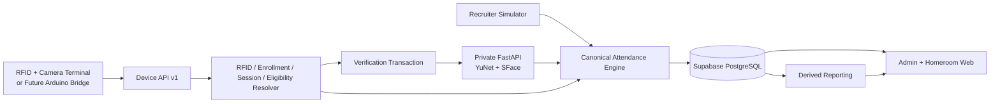
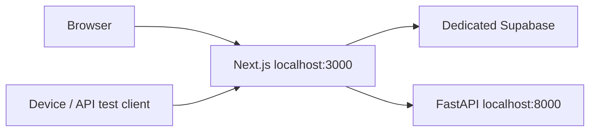

# V1 Architecture

**Status:** Implemented baseline — ready for user E2E testing  
**Source of truth:** `docs/00-SOURCE-OF-TRUTH.md`  
**Last updated:** 2026-09-03

---

## 1. Architecture principles

1. Attendance truth is server/domain-owned, never browser-owned.
2. RFID identifies the expected student; face is 1:1 verification against that owner.
3. Simulator and physical hardware are adapters to canonical rules, not separate products.
4. Raw events, verification evidence, and canonical attendance are separate.
5. Schedules and participant targeting are configuration/data, not weekday hard-code.
6. Staff Auth identity and application authorization are separate concerns.
7. Biometric infrastructure is replaceable and minimized.
8. Device/client retries must be idempotent.
9. Unresolved ambiguous sessions fail closed.
10. Raw biometric images are not canonical stored data in V1.

---

## 2. Implemented technology stack

### Web / application

- Next.js App Router + TypeScript
- React
- Tailwind CSS
- Zod validation
- server actions / route handlers / server-only infrastructure adapters

### Data / Auth

- PostgreSQL in a dedicated Attendance System Supabase project
- Supabase Auth for staff identity
- server-only privileged RPC paths
- RLS-enabled public domain tables with default-deny browser access

### Face service

- Python 3.12
- FastAPI
- OpenCV YuNet face detection
- OpenCV SFace feature extraction / 1:1 comparison
- private service key between Next.js and the face service

### Testing

- Vitest for web/domain/application contracts
- pytest for face-service contracts
- GitHub Actions for install/lint/typecheck/tests/build/model smoke
- transaction/rollback live Supabase smoke tests for critical persistence paths

---

## 3. Logical V1 topology



The public recruiter simulator uses deterministic fixture resolution and canonical decision logic, but remains ephemeral. Real device/database mode uses the full resolver + transaction + persistence path.

---

## 4. Web application boundary

Responsibilities:

- staff login/session handling;
- role/class authorization guard;
- admin students/RFID/class-history management;
- browser face enrollment workflow;
- schedule configuration;
- device registry/monitoring;
- staff provisioning;
- homeroom reconciliation;
- reports/exports;
- recruiter simulator UI;
- versioned device HTTP endpoints.

Not responsible for:

- trusting client-submitted student/class/session identity;
- making attendance truth client-side;
- exposing Supabase secret/device secret/biometric embeddings to browser users;
- treating hidden buttons as authorization.

---

## 5. Canonical attendance domain engine

Framework-light domain code receives resolved/trusted context and decides:

- accepted on time;
- accepted late;
- face mismatch;
- no face / low quality / face-service error;
- unknown card;
- no session / outside window;
- not eligible;
- duplicate;
- face not required.

It returns normalized outcome + physical feedback semantics. It does not query the browser UI for policy.

Persistence is a separate interface; the Supabase implementation records the domain outcome atomically/idempotently.

---

## 6. Schedule and participant architecture

Configuration:

```text
attendance_session_templates
attendance_schedule_rules
```

Materialized runtime:

```text
attendance_session_occurrences
session_participants
```

Participant snapshots resolve from historical `student_enrollments` on the concrete occurrence date.

Materialization happens from:

- Device API current event date;
- Homeroom daily reads;
- report range reads.

Thus a day with zero scans still has explicit required participants and can become Pending.

Schedule engine supports one-off / DAILY / WEEKLY + BYDAY/INTERVAL subset and special NORMAL/ADDITIVE/REPLACE_NORMAL/CANCEL_NORMAL relationships.

---

## 7. Device API architecture

### Authentication

Device request carries:

```text
Authorization: Bearer <plaintext-device-secret>
X-Device-Id: <uuid>
X-Protocol-Version: v1
```

Only SHA-256 device-secret hash is stored in PostgreSQL.

### Stage 1

`POST /api/device/v1/card-scan`

```text
authenticate device
→ timestamp guard
→ materialize schedule
→ RFID owner
→ historical enrollment
→ candidate session + eligibility + duplicate
→ CAPTURE_FACE / ACCEPT_WITHOUT_FACE / normalized reject
```

### Stage 2

`POST /api/device/v1/face-verify`

A short-lived DB transaction binds:

```text
device + request + RFID UID + expected student + occurrence + active face profile
```

Stage 2 cannot change those bindings.

MATCH/MISMATCH finalization is atomic and consumes the transaction. Consumed-transaction replay returns the stored outcome instead of creating another attendance.

---

## 8. Face verification architecture

### Enrollment

```text
Admin browser camera
→ protected Next.js API
→ private FastAPI /v1/extract
→ quality gates + YuNet + SFace
→ embedding/fingerprint/model metadata
→ versioned ACTIVE face_profile in Supabase
```

Raw enrollment JPEG is not persisted in canonical DB.

### Verification

```text
Device JPEG
→ protected Next Device API
→ load expected embedding server-side
→ private FastAPI /v1/verify
→ quality gates + YuNet + SFace cosine comparison
→ canonical domain outcome
→ atomic verification/attendance persistence
```

No face / low quality is retryable while transaction remains active. Mismatch is a canonical rejected identity result.

V1 liveness is absent and explicitly reported false.

---

## 9. Persistence boundaries

Key separation:

```text
device_events              # raw / operational audit
verification_attempts      # biometric verification result/metadata
attendance_records         # canonical accepted session attendance
school_day_attendance      # formal day-level state
attendance_confirmations   # teacher S/I/A decisions
face_profiles              # versioned server-only face template metadata/embedding
audit_logs                 # admin/teacher changes
```

Critical accepted/rejected device finalization is transactionally/idempotently persisted.

---

## 10. Auth / RBAC architecture

```text
Supabase Auth session
→ verified user subject
→ profiles
→ role
→ homeroom_assignments / authorized classes
→ application command/query
```

User-editable Auth metadata is not role authority.

No public staff sign-up exists. First staff profile must be System Admin; later provisioning requires existing active System Admin authority.

---

## 11. Reporting architecture

Reports derive from canonical occurrences/participants/attendance/teacher confirmations rather than manually updated totals.

Before a report range is computed, required schedule occurrences are materialized.

Outputs:

- class/student H/T/S/I/A/Pending;
- raw attendance participation by session type;
- Excel-compatible CSV;
- Print / Save as PDF.

Future dates are clipped from pending totals.

---

## 12. Time model

- canonical instants stored as UTC/timestamptz;
- institution timezone stored explicitly;
- session windows and school dates resolved in institution-local time;
- device timestamps require timezone and pass clock-skew/replay guard;
- no attendance rule depends implicitly on server/laptop timezone.

---

## 13. Repository layout

```text
attendance-system/
├─ src/
│  ├─ app/                         # Next routes/UI/API/server actions
│  ├─ application/                 # orchestration/pure application services
│  ├─ contracts/                   # device/application DTO contracts
│  ├─ demo/                        # deterministic recruiter fixtures
│  ├─ domain/                      # canonical business rules
│  ├─ infrastructure/              # Supabase/face/device/report adapters
│  └─ lib/                         # auth/device helpers
├─ services/
│  └─ face-service/                # private FastAPI YuNet/SFace service
├─ supabase/
│  ├─ migrations/
│  └─ seed.sql
├─ scripts/                        # staff/device provisioning tooling
├─ docs/
└─ .github/workflows/ci.yml
```

Physical serial bridge/firmware folders should be added only when actual hardware work begins.

---

## 14. Current deployment/test topology

Local V1 user test:



The face service should remain private/server-side in deployed environments.

---

## 15. V1 automated evidence

GitHub CI verifies:

- Node dependency install;
- lint;
- TypeScript;
- Vitest;
- production build;
- Python dependency install;
- Python compile;
- pytest;
- official YuNet/SFace download;
- SHA-256 model verification;
- OpenCV model initialization.

Live Supabase transaction smoke verifies MATCH persistence/replay and MISMATCH rejection; smoke data is rolled back.

The next validation layer is the user's real browser camera/login/device-flow test documented in `docs/13-V1-TESTING-RUNBOOK.md`.

---

## 16. Explicit future hardening

Not part of the V1-complete software claim:

- liveness/presentation-attack detection;
- camera/population-specific threshold calibration;
- final overlapping-session routing priority;
- physical Arduino/ESP firmware/bridge validation;
- production edge rate limiting/observability/backups;
- real-school biometric privacy/consent/legal approval.
