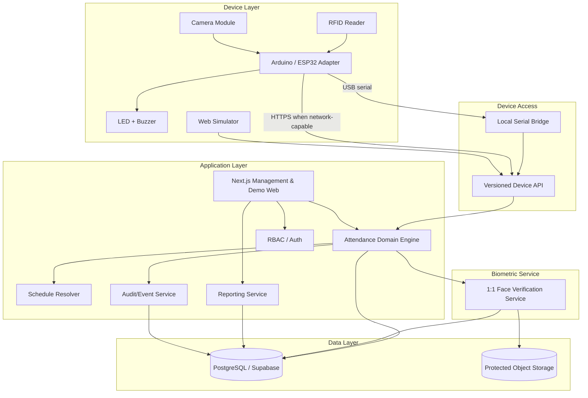
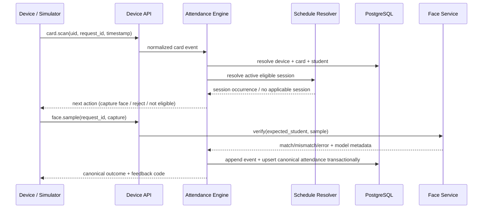
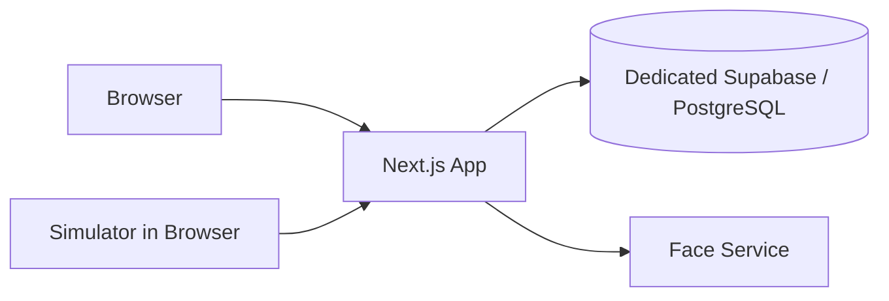
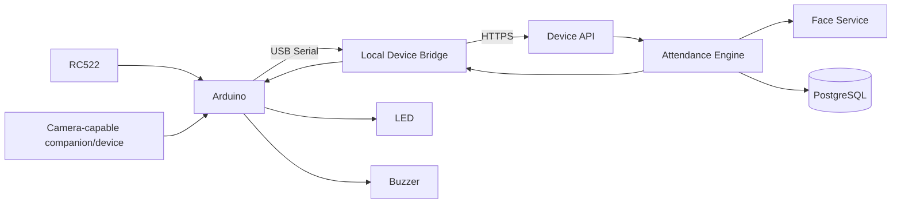
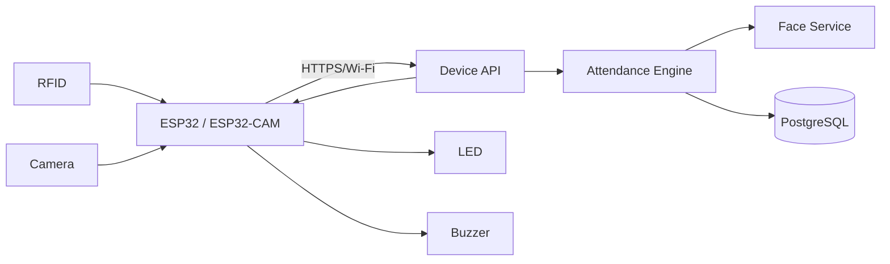

# Target Architecture

**Status:** Accepted baseline architecture — implementation started 2026-09-03  
**Source of truth:** `docs/00-SOURCE-OF-TRUTH.md`

This architecture is intentionally designed so the system can be fully developed and demonstrated without hardware, while remaining directly integrable with Arduino/ESP32-class devices later.

---

## 1. Architecture principles

1. **Domain logic is server-side.** Attendance validity, eligibility, lateness, duplicate rules, and final outcomes are not owned by the UI.
2. **Simulator and hardware are peers.** Both are device clients/adapters of the same contract.
3. **Face verification is replaceable.** Attendance logic calls a face-verification interface rather than depending directly on one library.
4. **Raw events are append-oriented; canonical attendance is derived/idempotent.**
5. **Schedules are data, not hard-coded conditions.**
6. **Role and school-scope authorization is enforced on the server.**
7. **Biometric data is isolated and minimized.**

---

## 2. Accepted technology stack

### Web application

- Next.js App Router + TypeScript
- React
- Tailwind CSS
- Server-side route handlers / backend-for-frontend where appropriate
- Zod for typed request/schema validation in the initial web boundary

Initial pinned baseline in `package.json`:

- Next.js 16.3.x
- React 19.2.x
- TypeScript 6.x
- Tailwind CSS 4.3.x

Versions are upgraded deliberately rather than floating silently.

### Core data platform

- PostgreSQL
- **Dedicated Supabase project for Attendance System** for managed PostgreSQL, authentication, storage when needed, and optional realtime capabilities
- Attendance System must not reuse the Spall Spill Supabase project, Auth tenant, Storage, tables, or credentials

The live project is intentionally pending until the owner explicitly selects the Supabase organization required by the project-creation operation.

### Face verification service

- Separate Python service boundary, preferably FastAPI
- OpenCV for capture/preprocessing utilities where useful
- A production-capable face embedding/verification implementation selected and calibrated later
- 1:1 verification API only for the core attendance flow

### Device bridge

- Python local bridge for USB/serial Arduino-style devices when needed
- Direct HTTPS device integration for Wi-Fi-capable ESP32-class devices when supported

### Reporting

- Server-side report queries/services
- XLSX/CSV export library
- PDF/print output generated from server-rendered or dedicated report templates

### Testing

- Vitest/unit tests for domain rules
- Integration tests for API/database boundaries
- End-to-end tests for web and simulator flows
- Contract tests for device protocol

---

## 3. Logical system diagram



---

## 4. Application boundaries

### 4.1 Web UI

Responsibilities:

- authentication entry;
- dashboard and class views;
- student/RFID/face enrollment workflows;
- schedule/calendar configuration;
- special events;
- reports and exports;
- device monitoring;
- simulator controls.

Not responsible for:

- deciding attendance truth client-side;
- directly writing trusted attendance statuses to the database;
- embedding device secrets in browser code;
- performing authoritative RBAC only through hidden UI controls.

### 4.2 Attendance Domain Engine

This is the central business-rule boundary. The first pure implementation lives under `src/domain/attendance`.

Responsibilities:

- resolve accepted/rejected canonical outcome from trusted resolved context;
- enforce verification requirements;
- apply timing/late rules;
- enforce duplicate/canonical attendance rules;
- preserve participant eligibility semantics;
- return normalized device/domain outcome and physical feedback code;
- later persist canonical outcome through a transaction/service boundary.

Resolution of student/card/session data will move behind repository/service interfaces as persistence is introduced. The engine remains independent from simulator UI.

### 4.3 Schedule Resolver

Responsibilities:

- ordinary school calendar;
- recurrence rules;
- holidays/cancellations;
- special events;
- additive vs replacing schedules;
- participant resolution;
- current active session lookup;
- future occurrence preview.

The resolver must make schedule behavior deterministic and testable.

### 4.4 Face Verification Service

Interface concept:

- enroll reference/template;
- validate sample quality;
- verify sample against one expected person;
- return result + model/version + score/confidence metadata suitable for audit;
- delete/revoke reference.

It must not be responsible for attendance eligibility or teacher absence classification.

### 4.5 Reporting Service

Responsibilities:

- compute summaries from canonical records;
- apply period/class/student filters;
- produce consistent totals;
- support exports;
- avoid independent manual tally tables that can drift from source data.

### 4.6 Audit/Event Service

Responsibilities:

- append raw device events;
- verification attempts;
- administrative changes;
- attendance corrections;
- role/device/schedule changes;
- timestamps/actors/request identifiers.

Raw audit/security events must not be editable like ordinary student profile fields.

---

## 5. Request flow — RFID + face verification



The current recruiter demo replaces external resolution with deterministic fixtures, then invokes the same pure decision engine. It does not write attendance directly from the client.

---

## 6. Data ownership and write paths

Preferred rule:

- browsers do not receive privileged direct write access to attendance truth;
- device clients do not write database tables directly;
- face service cannot independently create attendance;
- all canonical attendance writes go through the domain service/backend transaction boundary;
- teacher confirmations go through authorized application commands with audit entries.

---

## 7. Transaction and idempotency model

Each device submission should carry an idempotency/request identifier.

For attendance creation, use a uniqueness boundary conceptually equivalent to:

- `student_id + session_occurrence_id + attendance_role/mode`

Exact schema may differ by session mode, but replaying the same valid event must not create duplicate canonical attendance.

Raw events can still preserve repeated scans with their own unique event IDs.

---

## 8. Time and timezone model

- Store canonical timestamps in UTC.
- Store institution timezone explicitly.
- Resolve session windows using institution-local time.
- Never compare server-local machine time implicitly.
- Report labels/dates should use the institution timezone.

Initial school context is expected to use Indonesia time, but timezone must be configuration rather than hard-coded business logic.

---

## 9. Deployment topology — development/demo



During the current foundation slice, database and real face adapters are not connected yet; the simulator can still exercise canonical decision logic.

---

## 10. Deployment topology — future physical Arduino



If the exact original hardware uses separate boards for camera and RFID, adapters can normalize their events before the Device API without changing the domain layer.

---

## 11. Deployment topology — future ESP32-class terminal



---

## 12. Accepted repository layout

Start app-first rather than creating a monorepo before multiple deployable services exist:

```text
attendance-system/
├─ src/
│  ├─ app/                    # Next.js routes, API routes, UI
│  ├─ components/             # reusable UI
│  ├─ contracts/              # versioned device/application DTOs
│  ├─ demo/                   # deterministic simulator adapters/fixtures
│  └─ domain/                 # framework-light business rules
├─ database/                  # migration/schema workspace
├─ services/
│  └─ face-service/           # added when real biometric service begins
├─ device/
│  ├─ serial-bridge/          # added when Arduino bridge begins
│  └─ firmware/               # added when physical hardware work begins
├─ tests/                     # integration/e2e/contract suites as needed
├─ docs/
├─ AGENTS.md
├─ SKILLS.md
└─ WORK.md
```

Do not move the web app into `apps/web` merely to look like a monorepo. Introduce workspace tooling only when multiple real packages/services justify it.

---

## 13. Observability

At minimum plan for:

- structured application logs;
- request/event IDs propagated across device → attendance → face service;
- device last-seen/health state;
- rejected verification metrics;
- domain error classification;
- audit logs for privileged mutations.

Do not log raw biometric payloads or secrets.

---

## 14. Failure strategy

The terminal must receive explicit outcomes rather than hanging indefinitely.

Examples:

- database unavailable → temporary system error; do not pretend attendance succeeded;
- face service unavailable → verification service error; do not classify as face mismatch;
- duplicate request → return prior/idempotent result when possible;
- no session → no attendance created;
- invalid device credentials → reject before processing student data.

Offline queuing for physical devices is a post-MVP capability unless explicitly promoted.

---

## 15. Remaining architecture gates

The following are deliberately deferred until their implementation slice:

1. exact face verification engine/model and calibration process;
2. public recruiter demo vs authenticated management deployment isolation;
3. demo data-reset strategy after persistence exists;
4. initial report export library/template;
5. biometric reference/snapshot storage and retention policy;
6. overlapping active-session routing policy.

Database provider and repository layout are no longer open: use a dedicated Supabase project and the app-first layout defined above.
