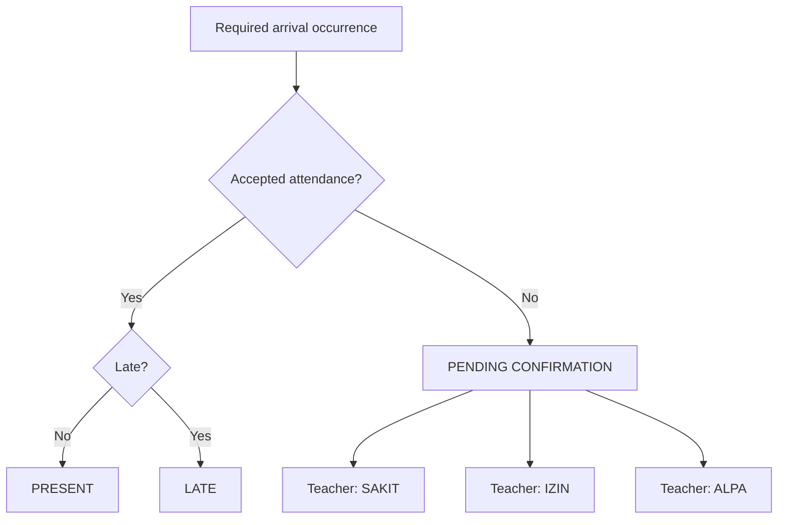

# Domain Model & Data Rules

**Source of truth:** `docs/00-SOURCE-OF-TRUTH.md`

This document defines the conceptual entities and invariants. It is intentionally independent from a specific ORM so the database can evolve without changing product semantics.

---

## 1. Core domain entities

### Institution

Represents the school/system configuration.

Key concepts:

- name;
- timezone;
- active academic year;
- attendance policy references;
- configuration metadata.

### AcademicYear

- label, e.g. `2026/2027`;
- start/end date;
- active flag/status.

### Term / Semester

- belongs to AcademicYear;
- label/sequence;
- start/end date.

### GradeLevel

Examples: Grade 10, Grade 11, Grade 12.

### Class

Examples: `X RPL 1`, `XI RPL 2`.

Belongs to a grade level and optionally a department/major.

### User

Management-system identity.

Possible roles:

- System Admin;
- Homeroom Teacher;
- Operator.

### HomeroomAssignment

Links a teacher to one or more classes for a defined academic period.

### Student

Stable person identity.

### StudentEnrollment

Historical relationship of a student to class/academic year. Attendance should reference the relevant enrollment context so history does not change when a student moves class.

### RFIDCredential

- UID;
- student;
- active/revoked state;
- registered_at / registered_by;
- optional device/source metadata.

Active UID uniqueness is required.

### FaceProfile

Represents the approved verification reference/template for one student.

Store model/template version and enrollment audit metadata. Raw image storage is optional and governed by retention policy.

### AttendanceSessionTemplate

Reusable session definition/category, e.g.:

- School Arrival;
- School Departure;
- Dhuha;
- Dzuhur;
- Ashar;
- Ceremony;
- School Activity;
- Custom.

### AttendanceScheduleRule

Defines recurrence/target/time policy used to generate or resolve occurrences.

### AttendanceSessionOccurrence

Concrete session on a specific date/time with a resolved configuration and target scope.

This is the key unit that students attend.

### SessionParticipant / Eligibility Snapshot

Represents or can deterministically resolve which students are eligible/required for a particular occurrence.

For audit stability, consider snapshotting the resolved participant set when an occurrence is published/activated.

### Device

Physical terminal or simulator identity.

### DeviceEvent

Append-oriented raw event, e.g. RFID scan, face result, duplicate scan, device heartbeat.

### VerificationAttempt

Correlates RFID identity, face attempt, expected student, model version, score/result, and device/session context.

### AttendanceRecord

Canonical accepted attendance for a student and session occurrence.

### SchoolDayAttendance

Derived/managed school-day classification used for formal daily attendance recap.

This should not replace session records. It summarizes the student's school-day attendance state after system facts and, when needed, homeroom confirmation.

### AttendanceConfirmation

Teacher/admin confirmation/change such as Sakit/Izin/Alpa, with actor/timestamp/history.

### AuditLog

Privileged administrative/user change history.

---

## 2. Suggested enum/status vocabulary

Final code names may vary, but semantics should remain explicit.

### VerificationResult

- `MATCH`
- `MISMATCH`
- `NO_FACE`
- `LOW_QUALITY`
- `SERVICE_ERROR`
- `NOT_REQUIRED`

### DeviceEventType

- `RFID_SCANNED`
- `UNKNOWN_CARD`
- `FACE_CAPTURED`
- `FACE_VERIFIED`
- `FACE_REJECTED`
- `ATTENDANCE_ACCEPTED`
- `ATTENDANCE_DUPLICATE`
- `NOT_ELIGIBLE`
- `OUTSIDE_SESSION`
- `DEVICE_HEARTBEAT`
- `DEVICE_ERROR`

### AttendanceRecordStatus

For a session-level accepted record:

- `ON_TIME`
- `LATE`
- optionally `COMPLETED` for sessions that have no late concept

Rejected attempts are not canonical attendance records; they belong in verification/device events.

### SchoolDaySystemState

- `PRESENT_ON_TIME`
- `PRESENT_LATE`
- `NO_VALID_ARRIVAL`
- `PENDING_CONFIRMATION`

### SchoolDayFinalStatus

- `PRESENT`
- `LATE`
- `SAKIT`
- `IZIN`
- `ALPA`

The system can derive PRESENT/LATE from accepted arrival, but SAKIT/IZIN/ALPA require human confirmation.

### SessionEligibility

- `ELIGIBLE`
- `NOT_ELIGIBLE`
- `CANCELLED`

### ScheduleRelationship

- `NORMAL`
- `ADDITIVE`
- `REPLACE_NORMAL`
- `CANCEL_NORMAL`

Exact implementation can use flags/policies, but behavior must remain distinguishable.

---

## 3. Key invariants

### INV-001 — Card ownership

An accepted RFID flow must resolve exactly one active student credential.

### INV-002 — Face ownership

When face verification is required, accepted attendance requires a successful 1:1 match against the RFID owner.

### INV-003 — No fake absence cause

The system cannot transform `NO_VALID_ARRIVAL` into SAKIT/IZIN/ALPA without an authorized human confirmation event.

### INV-004 — Eligibility before attendance

A student not eligible for an occurrence cannot be counted absent or present for that occurrence.

### INV-005 — One canonical attendance per required slot

A student should not have multiple canonical records for the same logical attendance slot unless the session mode explicitly defines multiple checkpoints.

### INV-006 — Raw events survive corrections

Editing/correcting a canonical attendance record must not delete the underlying raw device/verification audit trail.

### INV-007 — Historical class stability

Reports for past periods use the student's historical enrollment/class context, not only their current class.

### INV-008 — Timezone determinism

Session date/window decisions are evaluated in the institution timezone.

### INV-009 — Schedule configuration over hard-code

Dhuha days, prayer times, arrival thresholds, holidays, and special events must come from configuration/data.

---

## 4. Conceptual relationships

```mermaid
erDiagram
    INSTITUTION ||--o{ ACADEMIC_YEAR : has
    ACADEMIC_YEAR ||--o{ TERM : has
    ACADEMIC_YEAR ||--o{ STUDENT_ENROLLMENT : contains
    GRADE_LEVEL ||--o{ CLASS : groups
    CLASS ||--o{ STUDENT_ENROLLMENT : contains
    STUDENT ||--o{ STUDENT_ENROLLMENT : has
    STUDENT ||--o{ RFID_CREDENTIAL : owns
    STUDENT ||--o{ FACE_PROFILE : owns
    CLASS ||--o{ HOMEROOM_ASSIGNMENT : assigned
    USER ||--o{ HOMEROOM_ASSIGNMENT : teaches
    ATTENDANCE_SESSION_TEMPLATE ||--o{ ATTENDANCE_SCHEDULE_RULE : scheduled_by
    ATTENDANCE_SCHEDULE_RULE ||--o{ ATTENDANCE_SESSION_OCCURRENCE : creates
    ATTENDANCE_SESSION_OCCURRENCE ||--o{ ATTENDANCE_RECORD : receives
    STUDENT ||--o{ ATTENDANCE_RECORD : creates
    DEVICE ||--o{ DEVICE_EVENT : emits
    DEVICE_EVENT ||--o| VERIFICATION_ATTEMPT : correlates
    STUDENT ||--o{ SCHOOL_DAY_ATTENDANCE : summarized_as
    SCHOOL_DAY_ATTENDANCE ||--o{ ATTENDANCE_CONFIRMATION : confirmed_by
    USER ||--o{ ATTENDANCE_CONFIRMATION : makes
```

---

## 5. Session occurrence model

A concrete occurrence should be able to answer:

- What is this session?
- When does it open?
- When does it close?
- Is there a late threshold?
- Who is targeted?
- What verification is required?
- What attendance mode applies?
- Is it cancelled?
- Does it replace/add to normal schedule?
- Which school date does it belong to?

Suggested conceptual fields:

```text
id
institution_id
session_template_id
name_snapshot
type_snapshot
school_date
opens_at
late_after_at?
closes_at
verification_policy
attendance_mode
schedule_relationship
status
source_schedule_rule_id?
special_event_id?
created_at
```

Do not treat this as final SQL; it is a semantic checklist.

---

## 6. Attendance modes

The architecture should be able to represent at least:

### SINGLE_PRESENCE

One accepted verification means the session is attended.

Suitable for:

- Dhuha;
- Dzuhur;
- Ashar;
- single-check activities.

### CHECK_IN

One arrival/check-in event, potentially with late status.

### CHECK_OUT

One departure/check-out event.

### PAIRED_CHECK_IN_OUT

A special event can require both an entry and exit checkpoint.

Final UI exposure of these modes remains an open decision, but the domain should not prevent them.

---

## 7. Participant targeting

A schedule/session participant selector can conceptually target:

```text
ALL_STUDENTS
GRADE_LEVELS
CLASSES
DEPARTMENTS_OR_MAJORS
SELECTED_STUDENTS
```

At occurrence activation/publishing time, the system should be able to resolve the actual eligible student set from active enrollments.

### Important behavior

If an occurrence targets Grade 10 only:

- Grade 10 students → eligible;
- Grade 11/12 students → not eligible;
- Grade 11/12 students must not appear in absence denominator for that occurrence.

---

## 8. School-day status derivation

Conceptual derivation:



This summary is separate from prayer/activity session records.

---

## 9. Reporting derivation

Reports should query canonical facts such as:

- eligible session occurrences;
- accepted attendance records;
- school-day final statuses;
- lateness;
- special-event participation;
- prayer-session participation.

Avoid storing counters like `monthly_present_total` as manually edited source-of-truth fields. Caches/materialized views may be used later for performance if they remain reproducible from canonical data.

---

## 10. Open domain decisions

Do not finalize schema logic until these are discussed:

- effect of missing school departure on daily school status;
- prayer/activity denominator behavior for Sakit/Izin school days;
- exact manual correction model and approval authority;
- whether special-event check-in/out contributes to formal school-day attendance or remains event-only;
- how overlapping active sessions on the same device are selected when more than one applies;
- whether devices are assigned to specific session types/locations to disambiguate overlaps.
