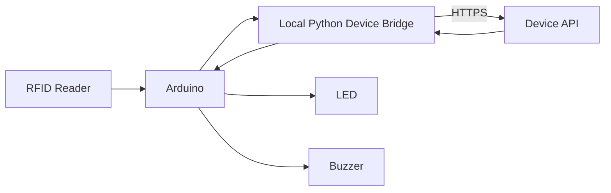
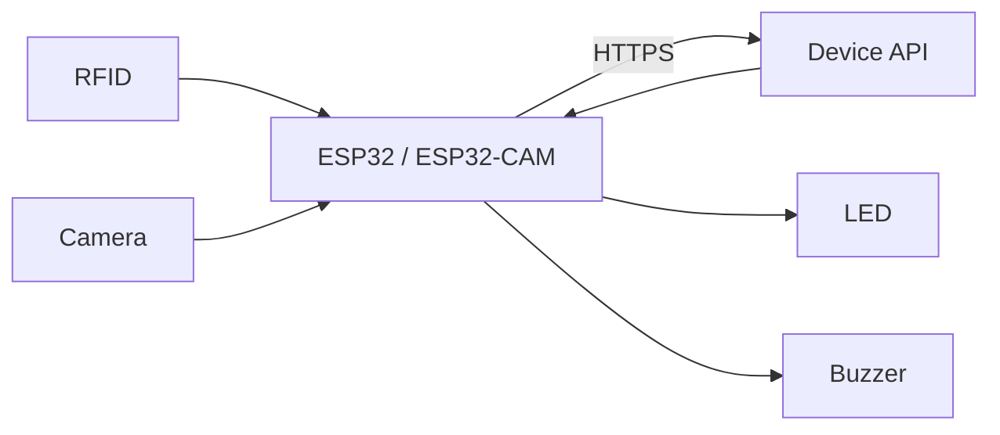

# Device Protocol & Simulator Contract

**Source of truth:** `docs/00-SOURCE-OF-TRUTH.md`

This document exists to prevent the demo implementation from becoming incompatible with future physical hardware.

---

## 1. Core rule

The **simulator and physical terminal are two clients of the same device-facing system**.

The simulator may provide controls that are impossible on hardware (for example choosing a test scenario), but once it emits a device event, that event must be processed through the same canonical backend/domain flow as real hardware.

---

## 2. Device responsibilities

A device/adapter may:

- read RFID UID;
- capture or upload a live face sample;
- identify itself and its capabilities;
- send heartbeat/health information;
- receive normalized feedback/result commands;
- render LED/buzzer/terminal feedback;
- retry requests safely using idempotency keys.

A device must **not** be the authoritative source for:

- whether a student is eligible for a session;
- whether a student is late;
- whether Sakit/Izin/Alpa applies;
- whether duplicate attendance should create another record;
- class/academic reporting totals.

Those belong to the backend/domain layer.

---

## 3. Supported adapter shapes

### A. Web simulator

Browser or server-assisted virtual terminal used for development and recruiter demo.

### B. Arduino over USB serial



The bridge converts serial messages to the versioned network contract.

### C. Network-capable ESP32-class device



---

## 4. Protocol versioning

All device requests should include or imply a protocol version, e.g. `v1`.

Breaking changes require a new version or explicit compatibility layer.

Suggested API namespace:

```text
/api/device/v1/...
```

Exact URLs are implementation details, but versioning is required.

---

## 5. Device identity

Each registered physical or simulated terminal should have:

```text
device_id
device_name
device_type
location?
protocol_version
capabilities[]
credential/public identity
active_status
last_seen_at
```

Typical capabilities:

```text
RFID_READER
CAMERA
GREEN_LED
RED_LED
BUZZER
DISPLAY
```

Device authentication must use server-issued credentials appropriate to the deployment. Never ship admin/user credentials in firmware.

---

## 6. Correlation and idempotency

Every attendance interaction should have a correlation/request identifier.

Example concept:

```json
{
  "request_id": "01J...",
  "device_id": "terminal-01",
  "protocol_version": "v1",
  "occurred_at": "..."
}
```

If a request is retried due to network uncertainty, the backend must be able to detect the same logical request and avoid duplicate canonical attendance.

---

## 7. Canonical interaction — staged flow

A staged flow is preferred because RFID identifies the expected person before biometric verification.

### Stage 1 — card scan

Conceptual request:

```json
{
  "request_id": "...",
  "event": "rfid.scan",
  "device_id": "terminal-01",
  "uid": "A4:B8:32:F1",
  "occurred_at": "..."
}
```

Possible normalized responses:

```text
CAPTURE_FACE
UNKNOWN_CARD
NO_ACTIVE_SESSION
NOT_ELIGIBLE
DEVICE_NOT_AUTHORIZED
SYSTEM_ERROR
```

If the backend returns `CAPTURE_FACE`, the response should include a short-lived verification transaction/token rather than exposing unnecessary student data to the device.

### Stage 2 — face sample

Conceptual request:

```text
verification_transaction_id
request_id / child_request_id
device_id
face_sample (file/blob/reference)
captured_at
```

The backend/service verifies the sample against the expected RFID owner.

Possible normalized outcomes:

```text
ACCEPTED_ON_TIME
ACCEPTED_LATE
ACCEPTED_COMPLETED
FACE_MISMATCH
NO_FACE
LOW_QUALITY
FACE_SERVICE_ERROR
DUPLICATE_ATTENDANCE
SESSION_CLOSED
SYSTEM_ERROR
```

---

## 8. Feedback codes

Do not force firmware to infer behavior from arbitrary text.

Backend responses should include a machine-readable feedback class/code.

Example conceptual mapping:

| Domain outcome | Feedback class | Physical behavior |
|---|---|---|
| Accepted | `SUCCESS` | Green LED + 1 short beep |
| Face mismatch | `IDENTITY_REJECTED` | Red LED + rapid repeated beeps |
| Unknown card | `CARD_ERROR` | Error pattern, TBD |
| Not eligible | `NEUTRAL_NOT_ELIGIBLE` | Neutral/short informational pattern, TBD |
| Duplicate | `ALREADY_RECORDED` | Informational pattern, TBD |
| Service/device error | `SYSTEM_ERROR` | Error pattern, TBD |

The only hardware patterns currently fixed by Source of Truth are success and face mismatch.

---

## 9. Face sample transport

The protocol should avoid base64 JSON for large image payloads unless there is a strong reason. Prefer:

- multipart upload;
- short-lived signed upload/reference;
- streaming/capture mechanism appropriate to the device.

Exact method depends on final face service and hardware constraints.

The device should send only what is necessary to verify the current request.

---

## 10. Simulator design

The simulator should visually represent a terminal while preserving architecture parity.

### Simulator states

```text
IDLE
CARD_READING
CARD_RESOLVED
FACE_CAPTURE
VERIFYING
SUCCESS
LATE_SUCCESS
FACE_MISMATCH
UNKNOWN_CARD
NOT_ELIGIBLE
DUPLICATE
OUTSIDE_SESSION
DEVICE_ERROR
```

### Recruiter scenario controls

Minimum controls:

- Successful Attendance
- Late Attendance
- Face Mismatch
- Unknown RFID
- Duplicate Attendance
- Not Eligible
- Camera/Face Service Error
- Special Event Attendance

Scenario controls may seed/select data, but must not directly write final attendance rows.

---

## 11. Real interactive face demo

Optional but desirable:

1. Recruiter creates a temporary demo student/session.
2. Browser camera enrolls a temporary face reference.
3. Virtual RFID identifies that temporary demo student.
4. Browser captures live sample.
5. Same face-verification service performs 1:1 verification.
6. Success/failure enters the canonical attendance engine.
7. Temporary biometric data is automatically expired/deleted according to demo policy.

This is distinct from deterministic scripted scenarios, which are useful for showing every failure state quickly.

---

## 12. Serial bridge concept

Future local bridge responsibilities:

- open configured serial port;
- parse simple framed firmware messages;
- attach secure device identity/network credentials;
- upload camera sample if architecture uses a companion camera source;
- call Device API;
- translate normalized feedback to firmware command;
- reconnect/retry safely;
- expose health/log state.

Example logical serial messages only:

```text
CARD|A4:B8:32:F1|<local_event_id>
STATUS|READY
```

Response concept:

```text
RESULT|SUCCESS
RESULT|FACE_MISMATCH
RESULT|UNKNOWN_CARD
```

The exact serial format is **not yet locked** and should be decided alongside real hardware integration.

---

## 13. Security requirements for device API

- authenticate device/bridge;
- use HTTPS on network links;
- rate-limit appropriately;
- idempotency/replay protection;
- validate timestamps with tolerance where used;
- avoid returning sensitive student/profile data unnecessarily;
- rotate/revoke device credentials;
- log device authentication failures;
- do not expose human admin session tokens to devices.

---

## 14. Contract testing

Before physical hardware is added, create automated contract tests proving that:

1. simulator requests conform to device schema;
2. the same request payload can be produced by a non-browser client;
3. duplicate request IDs are safe;
4. invalid device auth is rejected;
5. face mismatch returns rejection and no attendance;
6. success returns feedback compatible with one-beep/green behavior;
7. not-eligible does not create absence/presence;
8. version mismatches return explicit errors.

These tests are the guarantee that future hardware integration is an adapter task rather than a rewrite.
